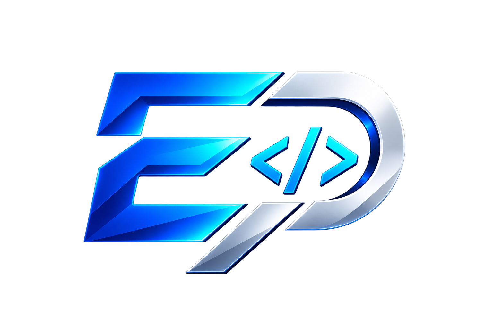

# 💻 Eduardo Panage — Developer Portfolio

<p align="center">
  
</p>

<p align="center">
  <strong>A responsive developer portfolio built with HTML, CSS, Bootstrap, JavaScript, and jQuery.</strong>
</p>

<p align="center">
  
  
  
  
  
</p>

## 📖 About the Project

**New Portfolio Bootstrap** is a personal developer portfolio created to showcase my skills, technologies, and projects as a software developer.

The website combines **Bootstrap's responsive layout system and components** with custom CSS and JavaScript/jQuery interactions to create a modern portfolio experience.

The project includes dedicated sections for personal presentation, technology stack, featured projects, and contact information. It also includes a responsive navigation menu and a **Dark Mode** switch.

## ✨ Features

### 👨‍💻 Personal Introduction

The hero section introduces the developer with:

* Personal presentation
* Developer-focused introduction
* Profile image
* Personal branding

### 🛠️ Tech Stack

The portfolio showcases technologies and tools currently being studied or used, including:

* HTML5
* CSS3
* JavaScript
* Bootstrap
* Python
* PostgreSQL
* GitHub
* Docker
* Trello

The technologies are displayed through visual icons in a responsive layout.

### 📂 Projects Showcase

The portfolio contains a dedicated projects section displaying completed and ongoing projects.

Currently featured projects include:

* **Serenatto — Café & Bistro**
* **Meteora Shop**
* **Secret Number Game**
* **Pleasant Linktree**
* **Alliance of the Small**
* **Library Management System**

Each project card contains:

* Project image
* Project description
* Technology stack
* Live preview link
* GitHub repository link

This creates a centralized place to explore both the applications and their source code.

### 🌓 Dark Mode

The website includes a Dark Mode switch implemented using **jQuery**.

When the switch is enabled, a `dark-mode` class is added to the `<body>` element. Disabling the switch removes the class.

### 📱 Responsive Navigation

The navigation system uses Bootstrap's responsive navbar and Offcanvas components to provide a mobile-friendly experience.

Main navigation items include:

* Home
* About
* Tech Stack
* Projects
* Contact

The navigation also provides access to the About page and the main sections of the portfolio.

## 🛠 Technologies & Tools

### Front-end

* **HTML5** — Semantic page structure
* **CSS3** — Custom styling and responsive adjustments
* **JavaScript** — Client-side functionality
* **jQuery 4.0.0** — DOM manipulation and event handling
* **Bootstrap 5.3.8** — Responsive layout and UI components
* **Bootstrap Icons** — Interface icons
* **Google Fonts** — Poppins, Barlow, DM Sans, and Roboto

Bootstrap, jQuery, Bootstrap Icons, and Google Fonts are loaded through CDN resources.

## 📂 Project Structure

```text
New-Portfolio-Bootstrap/
│
├── .vscode/
│
├── assets/
│   ├── icons/
│   ├── projects/
│   ├── Logo.png
│   ├── Perfil.jpg
│   └── favicon.png
│
├── pages/
│   └── about.html
│
├── styles/
│   └── style.css
│
├── index.html
├── script.js
└── README.md
```

The repository separates the main HTML page, additional pages, styling, JavaScript, and visual assets into dedicated directories.

## 🧩 Main Files

### `index.html`

The main portfolio page containing:

* Navigation
* Personal presentation
* Tech Stack
* Projects
* Contact section
* Responsive Bootstrap components

### `pages/about.html`

Additional page dedicated to presenting information about the developer.

### `styles/style.css`

Contains the portfolio's custom visual styling and complements Bootstrap's default styles.

### `script.js`

Contains the jQuery logic responsible for the Dark Mode switch.

### `assets/`

Stores images, icons, project screenshots, profile assets, logos, and favicon resources.

## 🚀 Getting Started

This project is a static front-end website, so no backend or package installation is required.

### 1. Clone the repository

```bash
git clone https://github.com/EduPanage/New-Portfolio-Bootstrap.git
```

### 2. Navigate to the project

```bash
cd New-Portfolio-Bootstrap
```

### 3. Open the project

Open `index.html` in your browser.

For development, using **Visual Studio Code + Live Server** is recommended.

## 📚 Concepts Practiced

This project was created to practice and reinforce:

* Semantic HTML
* CSS organization
* Responsive Web Design
* Bootstrap Grid System
* Bootstrap Navbar
* Bootstrap Offcanvas
* Responsive layouts
* DOM manipulation
* jQuery event handling
* Dark Mode implementation
* Asset organization
* External CDN integration
* Project presentation and portfolio design

## 🎯 Project Goals

The main goals of this project are to:

* Build a professional developer portfolio.
* Practice responsive interface development.
* Improve Bootstrap skills.
* Practice JavaScript and jQuery interactions.
* Organize multiple projects in a single portfolio.
* Provide an easy way for visitors and recruiters to explore projects and technologies.

## 🔗 Live Portfolio

The project is intended to serve as a central hub for showcasing my development work, technical skills, and projects.

**GitHub Repository:**

[](https://github.com/EduPanage/New-Portfolio-Bootstrap)

**Author:** [EduPanage](https://github.com/EduPanage)

## 📄 License

This project was developed for personal portfolio and educational purposes.
